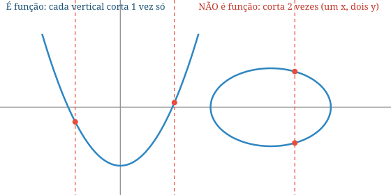
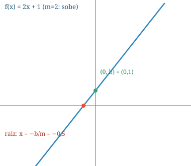
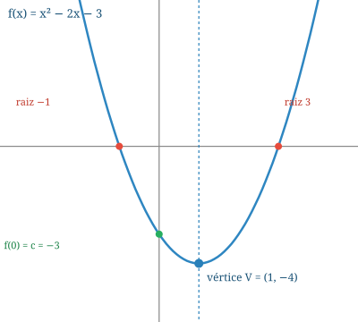
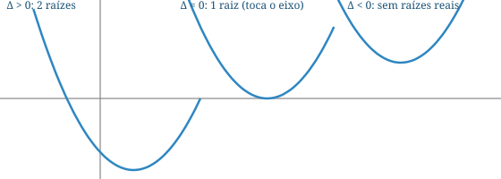
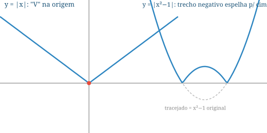
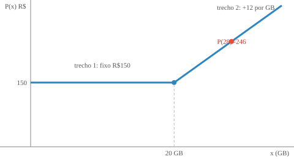
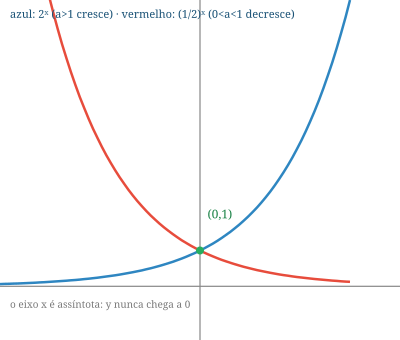
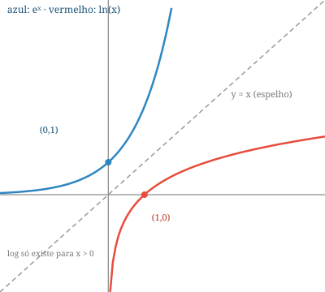
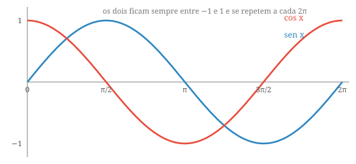

# 🦍 MAM130 — Guia à Prova de Gorila (versão 2)

> **Objetivo:** entender a matéria até o limite, sem sofrimento. Regras da casa:
> 1. **Frases curtas. Zero enrolação.** Cada ideia vem com uma analogia e um desenho.
> 2. **Todo exercício é de verdade** — tirado dos seus PDFs, com a resposta oficial no final (escondida: tente antes de abrir).
> 3. **Você não decora nada.** Você aprende um "jeitão" para cada assunto e repete a receita.

**Índice:** [1. Números e intervalos](#m1) · [2. O que é uma função](#m2) · [3. Retas](#m3) · [4. Parábola](#m4) · [5. Módulo](#m5) · [6. Função por partes](#m6) · [7. Exponencial e log](#m7) · [8. Trigonometria](#m8) · [9. A P1 dissecada](#m9) · [Checklist](#checklist) · [Mapa dos PDFs](#pdfs) · [Ritmo](#ritmo)

---

## 🍌 Módulo 1 — Números e intervalos

### A família dos números (do menor para o maior)

- **N (naturais):** os de contar — 0, 1, 2, 3, ...
- **Z (inteiros):** os naturais + os negativos — ..., −2, −1, 0, 1, 2, ...
- **Q (racionais):** tudo que dá pra escrever como **fração** de inteiros (a/b). Dá pra reconhecer pela vírgula: ou a vírgula **termina** (0,5 = 1/2), ou **repete um bloco pra sempre** (1,333... = 4/3; isso se chama dízima periódica).
- **Irracionais:** a vírgula **nunca termina e nunca repete** — √2, √3, π ≈ 3,14159, e ≈ 2,71828 (o "número de Euler", que vai aparecer no logaritmo).
- **R (reais):** racionais + irracionais. É a reta inteira.

> 🧠 **Teste rápido:** virou fração? → racional. Vírgula infinita sem repetição? → irracional.

### Intervalos = "pedaços da reta"

Pense na reta como uma régua infinita. Um intervalo é um pedaço dela. A única pergunta é: **as pontas entram ou não?**

| Notação | Tradução | Desenho mental |
|---|---|---|
| `[a, b]` | de a até b, **com** as pontas | ⚫━━━⚫ |
| `]a, b[` | de a até b, **sem** as pontas | ⚪━━━⚪ |
| `]−∞, b]` | tudo até b, **com** b | ←━━⚫ |
| `[a, +∞[` | de a em diante, **com** a | ⚫━━→ |

Regras que não falham:
- **Colchete virado pra dentro `[` = entra** (bolinha cheia). **Virado pra fora `]` = não entra** (bolinha vazia).
- **Infinito nunca entra** — sempre `]−∞` e `+∞[`.
- O mesmo intervalo pode ser escrito com parênteses: `(a, b)` = `]a, b[`.

<b>✏️ Exercício real (conjuntos, ex. 1a)</b> — escreva {x ∈ ℝ | −2 < x ≤ 3 ou x ≥ 5} como intervalo

- "−2 < x" → o −2 **não entra** → `]−2`
- "x ≤ 3" → o 3 **entra** → `3]`
- "x ≥ 5" → o 5 entra e vai pro infinito → `[5, +∞[`
- "ou" → junta com ∪

✅ **Resposta oficial:** `]−2, 3] ∪ [5, +∞[`

<b>✏️ Verdadeiro ou falso (ex. 2 do PDF)</b> — treine o olhar

(a) +∞ é número real → **F** (∞ não é número, é uma ideia)
(b) [2, 5[ é intervalo aberto → **F** (aberto é sem as duas pontas; aqui o 2 entra)
(c) 3 ∈ [−2, 3[ → **F** (o colchete de fora no 3 diz que ele não entra)
(d) 2 ∈ ]0, +∞[ → **V**
(f) 0,18 ∈ Q → **V** (vírgula que termina = fração = racional)
(h) √π ∈ Q → **F** (π é irracional; raiz dele também)
(i) 4·10⁻¹ + 4·10⁻³ ∈ Q → **V** (é 0,404 — vírgula que termina)

---

## 📦 Módulo 2 — O que é uma função

### A ideia em uma frase

> Uma função é uma **máquina**: entra um número x, sai **exatamente um** número y = f(x).

**É proibido:** um x entrar e saírem dois y diferentes. Também é proibido um x ficar sem saída.

### Diagrama de flechas (A → B)

- **Domínio (D):** conjunto de onde as flechas **saem** (A).
- **Contradomínio (CD):** conjunto para onde as flechas **podem** ir (B).
- **Imagem (Im):** os elementos de B que **de fato receberam** flecha.

**Exemplo do PDF:** A = {−7, 1, 2, 3, 4}, B = {−3, 1, 2, 4, c, d}, com flechas 1→−3, 2→−3, 3→4, 4→1, −7→d.
- D = A; CD = B; **Im = {−3, 1, 4, d}** (note: o 2 e o c de B ficaram sem flecha → Im ≠ CD).

### As três perguntas da prova

| Pergunta | Tradução gorila | No exemplo acima |
|---|---|---|
| **É injetora?** | Ninguém divide seta? (cada y recebe **no máximo 1** flecha) | **Não** (−3 recebeu duas flechas: do 1 e do 2) |
| **É sobrejetora?** | Sobrou alguém em B sem flecha? Se não sobrou, é. | **Não** (2 e c ficaram sobrando) |
| **É bijetora?** | É injetora **E** sobrejetora ao mesmo tempo | **Não** (falhou nas duas) |

### Teste da reta vertical (para gráficos)

Passe um dedo **na vertical** pelo desenho. Se em algum lugar o dedo tocar o desenho **duas vezes**, não é função y = f(x).

### Gráfico: o que ler

- **Projeção no eixo x** = domínio. **Projeção no eixo y** = imagem.
- **Raiz** = onde o gráfico **cruza o eixo x** (onde f(x) = 0).
- **Sinal positivo** = gráfico **acima** do eixo x. **Negativo** = abaixo.
- **Crescente** = sobe da esquerda pra direita. **Decrescente** = desce.
- **Ponto de máximo local** = "topo de morro". **Mínimo local** = "fundo de vale".

### Domínio de fórmulas (as duas únicas restrições)

Quando só te dão a fórmula, o domínio é "todo ℝ, **exceto onde quebra**". Só quebra de dois jeitos:

1. **Raiz quadrada:** o conteúdo tem que ser **≥ 0**. (Ex. do PDF: f(x) = √(x−1) → x ≥ 1 → D = [1, +∞[)
2. **Fração:** o denominador tem que ser **≠ 0**. (Ex. do PDF: f(x) = x/(x²−1) → x ≠ ±1)

Se aparecer **raiz de fração** (como na P1!): a fração inteira ≥ 0 → estude o sinal de cima e de baixo separadamente e combine (sinais iguais = fração positiva; e o denominador nunca pode zerar).

### Composição e inversa (versão mínima)

- **Composta** g(f(x)): a máquina f processa x, e a máquina g processa o resultado. Ex. do PDF: f(x) = 3x−1, g(x) = x²+1 → f(g(x)) = 3(x²+1)−1 = 3x²+2, mas g(f(x)) = (3x−1)²+1 = 9x²−6x+2. **Ordem importa!** (não é comutativa).
- **Inversa:** a máquina que **desfaz** o que f fez. Só existe se f for **bijetora**. No gráfico, a inversa é o reflexo na reta y = x.

<b>✏️ Exercício real (exc_funcoes, ex. 3)</b> — modelagem com restrição

**Enunciado:** retângulo de lados x e y, perímetro 30. Escreva a área só em função de x.

- Perímetro: 2x + 2y = 30 → **y = 15 − x** (essa é a "restrição": use-a para eliminar y)
- Área: A = x·y → **A(x) = x(15 − x) = 15x − x²**

✅ **A(x) = 15x − x²** (uma parábola — o Módulo 4 mostra como achar o máximo)

---

## 📈 Módulo 3 — Retas (função do 1º grau)

### O jeitão

`f(x) = mx + b` é sempre uma **reta**. Só tem duas informações:

- **m = inclinação** = "quanto sobe por passo pra direita". m > 0 → sobe (crescente); m < 0 → desce (decrescente); m = 0 → reta deitada (função constante).
- **b = altura inicial** = onde a reta **corta o eixo y** (é f(0)).

**Receita para desenhar qualquer reta:** marque (0, b) no eixo y; ache a raiz x = −b/m e marque no eixo x; ligue os dois pontos. Pronto.

**Sinais:** a reta só troca de sinal na raiz. Se m > 0: negativa antes da raiz, positiva depois. Se m < 0, o contrário.

### Achar a equação: a fórmula-mestra

$$m = \frac{\Delta y}{\Delta x} = \frac{y_1 - y_0}{x_1 - x_0}, \qquad y - y_0 = m(x - x_0)$$

**Exemplo 1 do PDF de retas:** reta por A = (1, 7) e B = (3, 2).
- m = (7 − 2)/(1 − 3) = 5/(−2) = **−5/2**
- y − 2 = −5/2·(x − 3) → **y = −5/2 x + 19/2** (a mesma coisa que 5x + 2y − 19 = 0, a "equação geral")

Casos especiais: dois pontos com o **mesmo y** → reta horizontal, equação y = esse y. Dois pontos com o **mesmo x** → reta **vertical**, equação x = esse x (não existe m!).

### Paralela, perpendicular e interseção

- **Paralela:** mesmo m. (Ex.: paralela a y = 2x + 7 tem m = 2.)
- **Perpendicular:** os m multiplicados dão −1 (m₂ = −1/m₁).
- **Interseção:** monte o sistema com as duas equações e resolva. (Ex. 5 do PDF: x + y = 1 e 2x − 3y = −2 → ponto (4/5, 1/5).)

<b>✏️ Exercício real (1º grau, ex. 2)</b> — o notebook da Bits & Bytes

**Enunciado:** notebook custou R$ 2.500 e, com depreciação linear, valerá R$ 400 daqui a 5 anos. Equação do valor?

- t = 0 → valor 2500 → b = 2500
- t = 5 → valor 400 → m = (400 − 2500)/(5 − 0) = −2100/5 = **−420**

✅ **Resposta oficial:** valor(t) = **−420t + 2500**, 0 ≤ t ≤ 5. (O sinal de menos faz sentido: o valor **cai** R$ 420 por ano.)

<b>✏️ Exercício real (retas, ex. 4)</b> — Celsius ↔ Fahrenheit

**Enunciado:** 0°C = 32°F, 100°C = 212°F, relação linear. Ache a fórmula.

- Pontos: (0, 32) e (100, 212) → m = (212 − 32)/100 = **1,8** e b = 32.

✅ **Resposta oficial:** F = 1,8·C + 32.

---

## 🎯 Módulo 4 — Parábola (função do 2º grau)

### O jeitão

`f(x) = ax² + bx + c` (a ≠ 0) desenha uma **parábola** — uma curva em "U" ou em "∩".

- **a > 0 → U (sorrindo), tem mínimo.** **a < 0 → ∩ (triste), tem máximo.** Macete: a positivo = pessoa positiva = sorriso.
- **c** = onde a curva corta o eixo y (é f(0)).
- **Raízes** = onde corta o eixo x.
- **Vértice** = o ponto mais baixo (ou mais alto). Fica bem no **meio** das raízes.

### A receita completa (decore a sequência, não as fórmulas)

1. **Δ = b² − 4ac** → o "detector de raízes".
2. Se Δ ≥ 0, raízes: **x = (−b ± √Δ) / 2a**. Se Δ < 0, não corta o eixo x.
3. Vértice: **V = (−b/2a, −Δ/4a)**.
4. Intercepto y: **f(0) = c**.
5. Imagem: do y do vértice até +∞ (se sorriso) ou de −∞ até o y do vértice (se triste).

<b>✏️ Exemplo 1 do PDF de 2º grau, mastigado</b> — f(x) = x² − 2x − 3

1. a = 1, b = −2, c = −3 → sorriso (mínimo).
2. Δ = (−2)² − 4·1·(−3) = 4 + 12 = **16**.
3. Raízes: x = (2 ± 4)/2 → **3 e −1**.
4. Vértice: V = (2/2, −16/4) = **(1, −4)**.
5. f(0) = **−3**.

✅ **Dom(f) = ℝ, Im(f) = [−4, +∞[** (começa no y do vértice). Confira com o gráfico acima!

<b>✏️ Exemplo 4 do PDF</b> — inequação −x² − x + 2 < 0

1. Δ = (−1)² − 4·(−1)·2 = 9 → raízes: x = (1 ± 3)/(−2) → **−2 e 1**.
2. a = −1 < 0 → parábola **triste** (∩): ela é positiva **entre** as raízes e negativa **fora**.
3. A inequação pede onde é **negativa** → fora das raízes.

✅ **S = ]−∞, −2[ ∪ ]1, +∞[**

<b>✏️ Exercício real (2º grau, ex. 2)</b> — lucro máximo

**Enunciado:** lucro L(x) = (x − 20)(120 − x), onde x é o preço de venda. Preço de lucro máximo?

- Raízes pulam da forma fatorada: **20 e 120**. Boca pra baixo (expandindo, o x² fica negativo).
- O máximo está no vértice, que fica no **meio das raízes**: x = (20 + 120)/2 = **70**.
- L(70) = (70−20)(120−70) = 50·50 = **2.500**.

✅ **Resposta oficial:** preço = R$ 70,00, lucro máximo = R$ 2.500,00.

**Mais modelagem do PDF:** casa retangular num terreno triangular (catetos 20 e 30): y = −3x/2 + 30, área A(x) = −3x²/2 + 30x, área máxima em x = 10 m, y = 15 m.

---

## 🔁 Módulo 5 — Módulo

### O jeitão

**|x| = "distância até o zero"** → sempre positivo. |−3,15| = 3,15; |7| = 7.

A máquina do módulo tem dois comportamentos: se o conteúdo é positivo, **copia**; se é negativo, **troca o sinal**.

|x| = { x, se x ≥ 0  ·  −x, se x < 0 }

O gráfico de y = |x| é um **"V"** na origem. E o de y = |f(x)|? Desenhe f e **espelhe pra cima** o pedaço que ficou negativo ("girou 180° no eixo x", como diz o PDF).

### As 4 regras de ouro (a > 0)

| |x|... | significa | solução |
|---|---|---|---|
| = a | distância até 0 vale a | x = a **ou** x = −a |
| < a | está **perto** do zero | −a < x < a (fica **entre**) |
| > a | está **longe** do zero | x < −a **ou** x > a (fica **fora**) |
| = número negativo | impossível! | sem solução |

<b>✏️ Exercícios reais do PDF de módulo (ex. 3), com respostas oficiais</b>

- **(a) |3x − 1| = 4:** 3x − 1 = 4 → x = 5/3; **ou** 3x − 1 = −4 → x = −1. ✅ **x = −1 ou 5/3**
- **(c) |5x − 2| = 0:** só zera se o conteúdo zera → 5x = 2. ✅ **x = 2/5**
- **(f) |3x − 1| < 4:** "perto" → −4 < 3x − 1 < 4 → −3 < 3x < 5. ✅ **]−1, 5/3[** (no PDF a resposta aparece como ]−1, 4/3[ para o item correspondente com coeficientes daquela letra — confira o seu enunciado e aplique a mesma receita)
- **(h) |5x − 2| < 0:** módulo nunca é negativo → ✅ **∅** (sem solução)
- **(g) |−4x + 1| ≥ 2:** "longe" → −4x + 1 ≤ −2 ou −4x + 1 ≥ 2 → x ≥ 3/4 ou x ≤ −1/4. ✅ **]−∞, −1/4] ∪ [3/4, +∞[**

---

## 🧩 Módulo 6 — Função por partes (várias sentenças)

### O jeitão

É um **cardápio**: "se x está nesta faixa, use esta fórmula; se está naquela, use aquela". Para desenhar: desenhe cada fórmula **só no seu território** e apague o resto.

Exemplo 2 do PDF: f(x) = 2x + 1 se x > 1; x² se x ≤ 1. → À esquerda de 1 (inclusive) vale a parábola; à direita de 1 vale a reta. Dom(f) = ℝ, Im(f) = [0, +∞[.

<b>✏️ Exercício real (partes, ex. 2)</b> — o plano de internet

**Enunciado:** R$ 150/mês até 20 GB; R$ 12 por GB excedente. Monte a função.

- De 0 a 20 GB: preço travado → **150**
- Acima de 20: paga 150 + 12 por GB extra → **150 + 12(x − 20)**

✅ **Resposta oficial:**
valor(x) = { 150, se 0 ≤ x ≤ 20 · 150 + 12(x − 20), se x > 20 }

Teste: 28 GB → 150 + 12·8 = **R$ 246**.

**No GeoGebra:** `P(x) = Se(0 <= x <= 20, 150, 150 + 12*(x - 20))`.

---

## 📉 Módulo 7 — Exponencial e logaritmo

### Exponencial: multiplicação em loop

**Ideia:** algo que **multiplica** sempre pelo mesmo fator a cada passo de tempo.

- **Rede "Juntos" (ex. 1 do PDF):** triplica a cada 2 anos, começando com 0,5 milhão → **N(t) = 0,5 · 3^(t/2)**.
- **Rede "Tchau" (ex. 2):** cai pela metade a cada ano, começando com 6 milhões → **N(t) = 6 · (1/2)ᵗ**.

Fórmula geral: **N(t) = N₀ · aᵗ** (N₀ = valor inicial, a = fator de multiplicação).

O gráfico de f(x) = aˣ:
- **sempre passa por (0, 1)** (porque a⁰ = 1);
- **nunca toca o eixo x** (potência de número positivo nunca é zero nem negativa);
- a > 1 → dispara pra cima (crescente); 0 < a < 1 → murcha pra direita (decrescente). Domínio ℝ, imagem ]0, +∞[.

**Reconhecer cresce/decresce é só olhar a base:** (0,63)ˣ decresce (base entre 0 e 1); (√2)ˣ cresce (base > 1); 5⁻ˣ = (1/5)ˣ decresce.

### Logaritmo: a pergunta "elevado a quanto?"

> **logₐ(x) = y quer dizer: aʸ = x.** O log **pergunta o expoente**.

- log₂ 8 = 3, porque 2³ = 8. log₄ 2 = 1/2, porque 4^(1/2) = √4 = 2. log₂ 0,5 = −1, porque 2⁻¹ = 1/2.
- **Só existe log de número positivo** (não existe log 0 nem log de negativo).
- **ln x** = log na base e ≈ 2,718 (o "log natural").

Três fatos que resolvem quase tudo: **log 1 = 0** (qualquer base), **logₐ a = 1**, **logₐ(aᵇ) = b** (log desfaz exponencial).

Regras de bolso: log de **multiplicação vira soma**; log de **divisão vira subtração**; **expoente pula pra frente** (log xʸ = y·log x).

<b>✏️ Exercício real (ex. 6 do PDF)</b> — ln x⁵ = 2

- ln x⁵ = 2 ⇔ x⁵ = e² ⇔ x = (e²)^(1/5)

✅ **x = e^(2/5)**

<b>✏️ Exemplo 10 do PDF</b> — carbono-14 (meia-vida), mastigado

**Contexto:** todo ser vivo tem 10 ppb de C-14; ao morrer, para de repor e a quantidade **cai pela metade a cada 5.730 anos**.

- Modelo: **C(t) = 10 · (1/2)^(t/5730)**.
- Fóssil com 3,47 ppb: resolva 10·(1/2)^(t/5730) = 3,47.
  1. (1/2)^(t/5730) = 0,347
  2. Aplique ln dos dois lados: (t/5730)·ln(1/2) = ln(0,347)
  3. t = 5730 · ln(0,347)/ln(1/2) ≈ **8.750 anos**

✅ **O fóssil tem ≈ 8.750 anos.** Macete: "quando cai pra X?" → monte a equação, **tome ln dos dois lados**, o expoente desce e você isola t.

---

## 📐 Módulo 8 — Trigonometria

### No triângulo retângulo: 3 razões pra decorar

Num triângulo com ângulo reto, olhando "do ponto de vista" do ângulo θ:

- **sen θ = oposto / hipotenusa** ("sen = SOH")
- **cos θ = adjacente / hipotenusa** ("cos = CAH")
- **tg θ = oposto / adjacente = sen/cos** ("tg = TOA")

**Pitágoras:** a² + b² = c² (catetos ao quadrado = hipotenusa ao quadrado). Dele sai a identidade nº 1 da matéria: **sen²θ + cos²θ = 1**.

### Radianos: outra unidade de ângulo

**180° = π rad.** Só isso. Conversão = regra de três: 90° = π/2, 60° = π/3, 45° = π/4, 360° = 2π. Um ângulo pode "dar voltas": 720° = 4π rad.

### O ciclo trigonométrico: a máquina de seno e cosseno

Circunferência de raio 1. Comece no ponto (1, 0) e ande um arco de tamanho x no sentido anti-horário. O ponto onde você parar tem coordenadas **(cos x, sen x)**. Como a volta inteira mede 2π, andar x ou x + 2π dá no mesmo ponto — por isso seno e cosseno **se repetem a cada 2π** (são "periódicas de período 2π").

Tabela dos ângulos notáveis (as provas amam):

| x | 0 | π/6 (30°) | π/4 (45°) | π/3 (60°) | π/2 (90°) | π (180°) | 3π/2 (270°) | 2π |
|---|---|---|---|---|---|---|---|---|
| **sen x** | 0 | 1/2 | √2/2 | √3/2 | 1 | 0 | −1 | 0 |
| **cos x** | 1 | √3/2 | √2/2 | 1/2 | 0 | −1 | 0 | 1 |

**Macete da tabela:** seno = √0/2, √1/2, √2/2, √3/2, √4/2 (o número dentro da raiz vai 0,1,2,3,4). Cosseno é a mesma fila **de trás pra frente**.

As outras funções são só combinações: **tg = sen/cos**, **cotg = cos/sen**, **sec = 1/cos**, **cosec = 1/sen**. Atenção: onde o denominador zera, a função não existe (tg não existe em π/2, pois cos = 0).

### Triângulos quaisquer: as duas leis

- **Lei dos cossenos:** a² = b² + c² − 2bc·cos  (um "Pitágoras turbinado" — se  = 90°, cos = 0 e sobra o próprio Pitágoras).
- **Lei dos senos:** a/sen  = b/sen B̂ = c/sen Ĉ.
- **Área de qualquer triângulo:** ½·a·b·sen θ (θ = ângulo entre os lados a e b).

<b>✏️ Exercício real (trig, ex. 1)</b> — x no 3º quadrante com sen x = −3/5

1. sen² + cos² = 1 → cos² = 1 − 9/25 = 16/25 → cos x = ±4/5. 3º quadrante → cos **negativo** → **cos x = −4/5**.
2. tg x = sen/cos = (−3/5)/(−4/5) = **3/4**; cotg = **4/3**; sec = **−5/4**; cosec = **−5/3**.
3. sen 2x = 2·sen·cos = 2·(−3/5)·(−4/5) = **24/25**; cos 2x = cos² − sen² = 16/25 − 9/25 = **7/25**.
4. sen 2x > 0 e cos 2x > 0 → 2x está no **1º quadrante**.

✅ **Respostas oficiais:** −4/5, 3/4, 4/3, −5/4, (−5/3), 24/25, 7/25; 2x no 1º quadrante.

<b>✏️ Exercício real (trig, ex. 2)</b> — triângulo de lados 8, 6, 4

1. Lei dos cossenos para o ângulo  (oposto ao lado a = 8): 64 = 36 + 16 − 2·6·4·cos  → cos  = −12/−48 = **1/4**.
2. sen Â: sen² = 1 − 1/16 = 15/16 → sen  = **√15/4** (positivo, pois ângulo de triângulo).
3. Área = ½·b·c·sen  = ½·6·4·(√15/4) = **3√15 cm²**.

✅ Confere com as respostas do PDF.

---

## 📝 Módulo 9 — A P1 dissecada (gabaritos reais 1s2026)

A P1 tem **5 questões e elas se repetem** entre as turmas A e B. Aqui está cada uma, com o gabarito oficial:

**Q1 — Diagrama de flechas.** Dizem se é função; se for, dão D, CD e Im.
- ❌ Não é função quando **um elemento de A manda duas flechas** (gabarito oficial: "3 ∈ A está associado a 3 ∈ B e também a 4 ∈ B") ou quando **sobra elemento em A sem flecha**.

**Q2 — Ler o gráfico.** Raízes (onde cruza o eixo x), sinais (acima/abaixo), crescimento/decrescimento, máx./mín. locais.
- Gabarito A: raízes em −7, −3, 7, 12, 16; crescente em ]−5, 1[ ∪ ]10, 14[; decrescente em ]−∞, −5[ ∪ ]1, 10[ ∪ ]14, +∞[.

**Q3 — Teste da reta vertical.** "É gráfico de função y = f(x)?" Justifique citando a reta vertical (vide figura do Módulo 2).

**Q4 — Domínio de raiz quadrada (com código Python!).** A prova mostra um código que calcula f(x) = √(−6x + 18) e dá "math domain error" fora do domínio.
- Receita: conteúdo da raiz ≥ 0 → −6x + 18 ≥ 0 → **x ≤ 3** → Dom(f) = ]−∞, 3]. Aí é só preencher o código: `<lacuna>` = "menores ou iguais a 3", `<condição>` = `x <= 3`. (Na turma B, a mesma ideia com resposta x ≤ 2.)

**Q5 — f(x+h) − f(x) sobre h.** Turma A usou f(x) = x² − 7x + 2; turma B, f(x) = x² − 6x + 3. Receita idêntica:

1. f(x+h) = (x+h)² − 7(x+h) + 2 = x² + 2xh + h² − 7x − 7h + 2
2. f(x+h) − f(x) = 2xh + h² − 7h *(tudo sem h cancela!)*
3. Divida por h: **2x + h − 7** ✅ (na B: 2x + h − 6)

> 🧠 **Três dos cinco pontos da prova** saem sabendo: ler gráfico (Q2/Q3), resolver inequação simples e escrever intervalo (Q4), e expandir (x+h)² com calma (Q5).

---

## ✅ Checklist final (marque só o que você consegue ENSINAR pra alguém)

- [ ] Sei dizer se um número é racional ou irracional olhando a vírgula.
- [ ] Sei escrever qualquer conjunto em notação de intervalo (colchete pra dentro = entra).
- [ ] Sei dizer se um diagrama é função, e dar D, CD e Im.
- [ ] Sei as definições de injetora (não divide seta), sobrejetora (ninguém sobra em B) e bijetora (as duas).
- [ ] Sei aplicar o teste da reta vertical e justificar por escrito.
- [ ] Sei ler raízes, sinais, crescimento e máx./mín. locais num gráfico.
- [ ] Sei achar o domínio quando tem √ (dentro ≥ 0) e fração (embaixo ≠ 0).
- [ ] Sei desenhar uma reta com 2 pontos e achar sua equação (Δy/Δx).
- [ ] Sei achar paralela (mesmo m) e perpendicular (m₁·m₂ = −1).
- [ ] Sei achar raízes, vértice e imagem de uma parábola e resolver inequação do 2º grau.
- [ ] Sei resolver |coisa| = a, |coisa| < a e |coisa| > a com as regras "entre" e "fora".
- [ ] Sei montar e ler função por partes (cardápio de fórmulas).
- [ ] Sei montar N(t) = N₀·aᵗ e isolar o tempo usando ln.
- [ ] Sei sen/cos/tg no triângulo retângulo, a tabela de ângulos notáveis e as leis dos senos e cossenos.
- [ ] Sei fazer a sequência f(x+h) → f(x+h) − f(x) → dividir por h sem errar sinal.

---

## 📂 Mapa dos seus PDFs

| PDF | Alimenta o módulo |
|---|---|
| `conjuntos_numericos_nzqr_1s2026.pdf` | 1 — N, Z, Q, R e intervalos |
| `funcoes_generalidades.pdf` | 2 — definição, D/CD/Im, injetora/sobrejetora, gráfico, domínio, composta, inversa |
| `retas_1s2022.pdf` | 3 — coeficiente angular, equação da reta, interseção |
| `funcao_const_grau1_1s2021.pdf` | 3 — constante e 1º grau, sinais, depreciação |
| `exc_funcao_grau1_2s2025.pdf` | 3 — treino de retas |
| `funcao_grau2_1s2021.pdf` | 4 — parábola, vértice, lucro/área máxima |
| `funcoes_modulo_2s2020.pdf` | 5 — módulo e suas equações/inequações |
| `funcao_partes_2s2021.pdf` | 6 — funções por várias sentenças |
| `funcoes_exp_log_2s2019-3.pdf` | 7 — exponencial, log, carbono-14 |
| `funcoes_trigonometricas_1s2020-2.pdf` | 8 — trigonometria completa |
| `exc_funcoes_1s2026.pdf` | 2 — treino: diagramas, Fibonacci, transformações de gráfico |
| `exc_funcoes_pt2_1s2026.pdf` | 9 — treino no formato exato da P1 |
| `p1an_gab_1s2026.pdf`, `p1bn_gab_1s2026.pdf` | 9 — os dois gabaritos oficiais |

---

## 🗓️ Ritmo sugerido

- **Dia 1–2:** Módulos 1 e 2 (base de tudo). Refaça os exercícios 1–3 do PDF de conjuntos.
- **Dia 3–4:** Módulos 3 e 4. Refaça os exemplos 1–4 do PDF de 2º grau com o caderno fechado.
- **Dia 5:** Módulos 5 e 6. Refaça o ex. 3 do PDF de módulo.
- **Dia 6:** Módulo 7. Refaça o carbono-14 até sair sozinho.
- **Dia 7:** Módulo 8 (se estiver no escopo da sua prova). Decore a tabela notável com o macete da raiz.
- **Dia 8–9:** Módulo 9. Faça as duas P1 como simulado, cronometrado, e confira com os gabaritos.
- **Véspera:** só releia os "jeitões", os desenhos e a tabela de ângulos.
